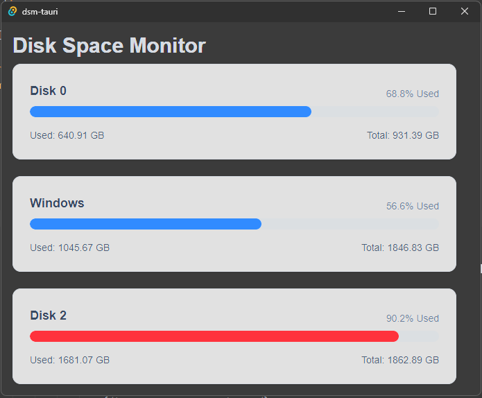

# Disk Space Monitor

Disk space monitor in Rust using the Tauri framework

## Features

- Monitor disk space usage
- Identify low disk space drives
- Visualize disk space usage
- System tray icon that flashes when low disk space is detected
- Launch the disk space clean up utility from the UI

## Running the app

- `cd dsm-tauri`
- `pnpm tauri dev`

